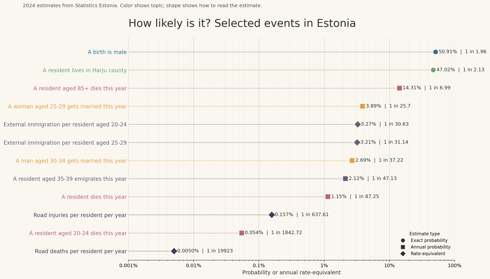

# Estonian Probability Scale

Probability scale of everyday events in Estonia built from official
Statistics Estonia data. The repository downloads raw data programmatically,
cleans it into tidy tables, computes event probabilities, and renders a
log-scale chart to help readers build intuition for probabilities across
several orders of magnitude.

## End Result



The main outputs are:

- `data/processed/events.csv` - machine-readable event table
- `outputs/probability_scale.png` - shareable preview image
- `outputs/probability_scale.svg` - publication-friendly vector graphic

## Repository Structure

- `scripts/stat_ee.py` - CLI for API metadata search and curated raw fetches
- `stat_ee/pipeline.py` - PxWeb client, query builder, retry logic, curated table specs
- `src/run_pipeline.py` - one-command runner for the full pipeline
- `src/clean_raw.py` - raw CSV cleanup and wide-to-long transforms
- `src/build_events.py` - event-level probability calculations
- `src/plot_probability_scale.py` - log-scale SVG and PNG chart renderer
- `src/common.py` - shared normalization, CSV IO, and formatting helpers
- `data/raw/` - fetched metadata, POST payloads, and raw source CSVs
- `data/processed/clean/` - cleaned tidy tables
- `data/processed/events.csv` - final event table
- `outputs/` - rendered chart assets
- `tests/` - unit tests for query building and label normalization

## Data Sources

Curated starter tables:

- `RV0282U` population by sex, age group and place of residence
  Human page: `https://andmed.stat.ee/en/stat/rahvastik__rahvastikunaitajad-ja-koosseis__rahvaarv-ja-rahvastiku-koosseis/RV0282U`
- `RV19` live births by child's sex and birth weight
  Human page: `https://andmed.stat.ee/en/stat/rahvastik__rahvastikusundmused__sunnid/RV19`
- `RV59U` deaths by county, age group, sex and marital status
  Human page: `https://andmed.stat.ee/en/stat/rahvastik__rahvastikusundmused__surmad/RV59U`
- `RV271` newly married persons by sex and age group
  Human page: `https://andmed.stat.ee/en/stat/rahvastik__rahvastikusundmused__abielud/RV271`
- `RVR03` migration by sex, age group and type of migration
  Human page: `https://andmed.stat.ee/en/stat/RVR03`
- `TS093` traffic accidents with casualties on the roads
  Human page: `https://andmed.stat.ee/en/stat/TS093`

Base API pattern:

- `GET https://andmed.stat.ee/api/v1/en/stat/<TABLE_ID>`
- `POST https://andmed.stat.ee/api/v1/en/stat/<TABLE_ID>`

## Requirements

- Windows with the Python launcher available as `py`
- Python 3.11+
- `matplotlib` for chart rendering

Install dependencies:

```powershell
py -3 -m pip install -r requirements.txt
```

## Execution Flow

Fastest full rebuild:

```powershell
py -3 src/run_pipeline.py
```

If you already have raw files locally and want to skip the live API step:

```powershell
py -3 src/run_pipeline.py --skip-fetch
```

Step-by-step flow:

1. Fetch raw metadata and curated CSV extracts:

```powershell
py -3 scripts/stat_ee.py fetch
```

2. Clean raw files and convert wide tables into tidy CSV:

```powershell
py -3 src/clean_raw.py
```

3. Build the final event table:

```powershell
py -3 src/build_events.py
```

4. Render the probability scale:

```powershell
py -3 src/plot_probability_scale.py
```

Optional helpers:

```powershell
py -3 scripts/stat_ee.py metadata
py -3 scripts/stat_ee.py search migration
py -3 scripts/stat_ee.py fetch RV19 TS093
py -3 scripts/stat_ee.py metadata --language et
```

## Raw Layer

The fetch command does not hardcode PxWeb variable codes blindly. It:

1. downloads live metadata for each table
2. resolves dimensions by `text` and bilingual fallback aliases
3. resolves requested value codes from `valueTexts`
4. submits the POST body and saves both the query and the raw response

Raw outputs are written to `data/raw/`:

- `data/raw/metadata/<TABLE_ID>.json`
- `data/raw/queries/<TABLE_ID>.json`
- `data/raw/<name>.csv`

The HTTP client retries `429 Too Many Requests` and transient 5xx responses
with exponential backoff.

## Clean Layer

`src/clean_raw.py` reads raw CSV files with `encoding="utf-8-sig"` to avoid
BOM-related header bugs. It also standardizes mixed English and Estonian labels.

Examples:

- `Kogu Eesti` -> `whole_country`
- `Mehed ja naised` -> `total`
- `Ascending total` -> `total`

Wide source tables are converted to tidy form:

- population: `year, sex, place, age_group, population`
- births: `year, birth_weight, sex, births`
- marriages: `year, sex, marriage_type, age_group, marriages`
- deaths: `year, county, age_group, deaths`
- migration: `year, sex, age_group, migration_type, metric, value`
- traffic: `year, indicator, month, value`

## Event Table

`src/build_events.py` writes `data/processed/events.csv` with:

`event_id,event_label,category,estimate_type,year,numerator,denominator,probability,odds_1_in,notes`

The current chart includes 12 events:

- birth is male
- resident lives in Harju county
- resident aged 85+ dies within one year
- female aged 25-29 gets married within one year
- resident aged 20-24 immigrates within one year
- resident aged 25-29 immigrates within one year
- male aged 30-34 gets married within one year
- resident aged 35-39 emigrates within one year
- resident dies within one year
- annual injured persons in road accidents per resident
- resident aged 20-24 dies within one year
- annual road-accident deaths per resident

Example rows from `events.csv`:

| event_id | estimate_type | probability | odds_1_in |
|---|---|---:|---:|
| `birth_male` | `exact_probability` | 0.509082 | 1.96 |
| `resident_harju` | `exact_probability` | 0.470154 | 2.13 |
| `death_85_plus` | `annual_probability` | 0.143089 | 6.99 |
| `road_death_equivalent` | `rate_equivalent` | 0.00005 | 19923 |

## Assumptions And Limitations

- The curated fetch setup is validated against the `/en/` API, but `/en/`
  responses can still contain Estonian variable codes and value labels.
- `RV0282U` is fetched for the two latest years so that 2024 event denominators
  can align with 2024 deaths, marriages, migration, and traffic counts.
- Population is currently limited to `whole_country` and `harju_county` because
  those are enough for the current event set.
- Traffic injuries are not a strict unique-person probability. They are a
  resident-year rate equivalent based on injured-person counts.
- Road-accident deaths are handled the same way: a count-based annual rate
  equivalent, not a unique-person probability.
- Marriage probabilities are calculated from marriage counts divided by the
  matching population subgroup. They are useful annual odds, not lifetime odds.
- The current event set is intentionally curated rather than exhaustive.
  It is designed to cover several orders of magnitude with interpretable events.
- The project is fully reproducible from code, but a polished submission should
  also include honest git work history rather than a single final snapshot.

## Possible Extensions

- Add Jeffreys-smoothed estimates for sparse cells and show them beside the raw
  observed probabilities.
- Add confidence intervals or plausible intervals where the event definition is
  naturally binomial.
- Expand to more life-course events, for example age-specific births or county-
  specific mortality.
- Refine the plotting layer with small source labels or uncertainty bars.

## Exact Vs Rate-Based Events

Exact probabilities:

- `birth_male`
- `resident_harju`

Approximate annual probabilities based on counts over population:

- `death_85_plus`
- `death_any`
- `death_20_24`
- `marriage_female_25_29`
- `marriage_male_30_34`
- `immigration_20_24`
- `immigration_25_29`
- `emigration_35_39`

Rate-based equivalent rather than a strict person-level probability:

- `road_injury_equivalent`
- `road_death_equivalent`

## AI Usage

AI was used as a coding and writing assistant during implementation. The event
definitions, denominator choices, data joins, and output review were manually
checked, and the repository is structured to remain readable by a human
reviewer.

## License

This project is released under the MIT License. See [LICENSE](LICENSE).

If a table changes and an alias stops matching, inspect the latest metadata JSON
and update the alias lists in [stat_ee/pipeline.py](stat_ee/pipeline.py).
